# Swadeshi

An editorial craft-provenance explorer for Bangladeshi craft, built as a
full-stack application. Instead of a generic product grid, Swadeshi leads with
evidence: where a craft is made, the material and technique behind it, and a
linked source for the cultural context. A local API and database back the
catalog, user accounts, a personal saved collection, and order records.


## Overview

Most craft storefronts open with price, category, and a vague claim of
authenticity. Swadeshi takes the opposite position. Every record answers a
single question before any purchase-oriented action appears:

> What am I actually looking at, and why does it matter?

The project pairs an opinionated, evidence-led frontend with a small,
security-conscious backend. Cultural context is source-linked to references such
as UNESCO and Banglapedia; object-specific imagery is labelled illustrative
until its origin and licence are verified. The catalog, accounts, saved
collections, and orders are all persisted in a local SQLite database through a
REST API.

## Features

- **Editorial craft index** — browse database-backed craft records with category
  filtering and sorting by region or technique. The active category lives in the
  URL, so a filtered view can be shared and survives a reload.
- **Craft records** — each product page presents region, material, technique,
  and a record status, plus a linked research source and an image credit.
- **User accounts** — register and log in with email and password. Passwords are
  hashed (bcrypt) and never stored in plain text; sessions use signed JWTs.
- **Saved collection** — logged-in users save records to a personal collection
  that is stored server-side and tied to their account.
- **Cart and orders** — add records to a cart (persisted locally) and place an
  order. Orders are written to the database with server-recomputed totals, so
  the recorded amount cannot be tampered with from the client. No payment is
  taken.
- **Maker context** — artisan profiles are framed as craft communities and
  traditions with transparent information scope.
- **Resilient UI** — route-level code splitting and an error boundary. If the API
  is unreachable, the catalog degrades to bundled sample records and flags that
  it is running offline, instead of showing a broken page.
- **Honest 404s** — an unknown product or artisan ID renders the Not Found page
  rather than silently showing the first item.
- **Hardened API** — CORS allowlist, rate limiting, request-body size caps,
  schema validation on every write, and sanitized error responses.

## Architecture

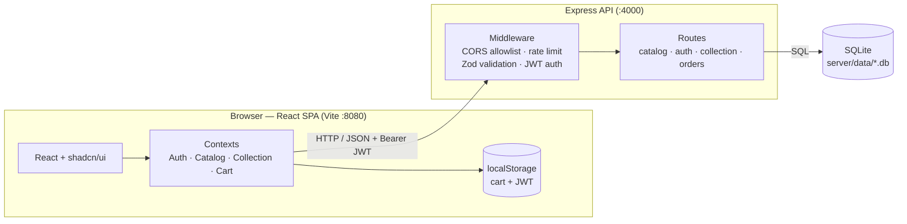

The frontend never touches the database directly. It calls the API over HTTP,
attaching a JWT for authenticated actions. Product imagery ships with the
frontend bundle and is matched to records by key, so the API stays lightweight
and serves only JSON.

## Tech stack

**Frontend** — Vite, React 18, TypeScript (strict), React Router, Tailwind CSS,
shadcn/ui (Radix), Framer Motion, Sonner. Tested with Vitest and Testing Library.

**Backend** — Node.js, Express, `node:sqlite` (built-in SQLite), bcrypt for
password hashing, JSON Web Tokens for sessions, Zod for input validation, Helmet
and express-rate-limit for hardening.

## Getting started

### Prerequisites

- Node.js 22.5 or newer (the API uses the built-in `node:sqlite` module)
- npm 10 or newer

### 1. Start the API

```sh
cd server
cp .env.example .env      # adjust values if you like
npm install
npm run seed              # create and populate the local database
npm run dev               # API on http://localhost:4000
```

### 2. Start the frontend

In a second terminal, from the project root:

```sh
npm install
npm run dev               # app on http://localhost:8080
```

The frontend reads the API base URL from `VITE_API_URL` (see `.env.example`) and
falls back to `http://localhost:4000/api` if it is not set.

## Scripts

### Frontend (project root)

| Command | Description |
| --- | --- |
| `npm run dev` | Start the Vite dev server on port 8080 |
| `npm run build` | Production build to `dist/` |
| `npm run preview` | Preview the production build |
| `npm run lint` | Run ESLint over the project |
| `npm run typecheck` | Type-check with the TypeScript project references |
| `npm test` | Run the unit test suite once |

### Backend (`server/`)

| Command | Description |
| --- | --- |
| `npm run dev` | Start the API with file watching |
| `npm start` | Start the API |
| `npm run seed` | Create and populate the SQLite database |

## API reference

| Method | Path | Auth | Purpose |
| --- | --- | --- | --- |
| `GET` | `/api/health` | — | Liveness check |
| `GET` | `/api/products` | — | List craft records |
| `GET` | `/api/products/:id` | — | One record (404 if unknown) |
| `GET` | `/api/artisans` | — | List craft contexts |
| `GET` | `/api/artisans/:id` | — | One context |
| `GET` | `/api/categories` | — | Categories with computed counts |
| `POST` | `/api/auth/register` | — | Create an account |
| `POST` | `/api/auth/login` | — | Log in, returns a JWT |
| `GET` | `/api/auth/me` | JWT | Current user |
| `GET` | `/api/collection` | JWT | The user's saved records |
| `POST` | `/api/collection` | JWT | Save a record |
| `DELETE` | `/api/collection/:id` | JWT | Remove a saved record |
| `POST` | `/api/orders` | JWT | Place an order (server recomputes total) |
| `GET` | `/api/orders` | JWT | The user's order history |

## Project structure

```
src/                     Frontend (React + TypeScript)
  assets/                Bundled images
  components/            Reusable UI (Navbar, Footer, cards, cart drawer, error boundary)
    ui/                  shadcn/ui primitives in use
  contexts/              Auth, Catalog, Collection, and Cart state
  data/                  Types, sample/offline-fallback records, editorial stories
  lib/                   API client, asset mapping, pure cart/shop logic (unit-tested)
  pages/                 Route views (Home, Shop, ProductDetail, Login, Account, ...)
server/                  Backend (Express + SQLite)
  src/
    routes/              catalog, auth, collection, orders
    data/                seed records
    db.js                schema, connection, transactions
    index.js             app, middleware, hardening
docs/
  product-direction.md   Product thesis and content standard
  screenshots/           Screenshots referenced by this README
```

## Testing

Unit tests target the pure frontend logic where cheap tests catch real bugs —
cart operations, shop filtering and sorting, and data integrity.

```sh
npm test
```

Continuous integration runs lint, type-check, tests, and a production build on
every push and pull request (see `.github/workflows/ci.yml`).

## Screenshots

### Home

The landing page leads with the craft, then an impact section and curated
entry points into the catalog.

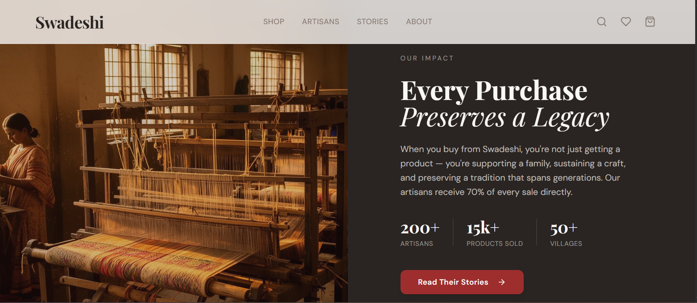

### Shop and product

The shop opens with an editorial banner, then a filterable, database-backed
craft index. Each record page shows region, material, technique, a source link,
and working add-to-cart and save-to-collection actions.

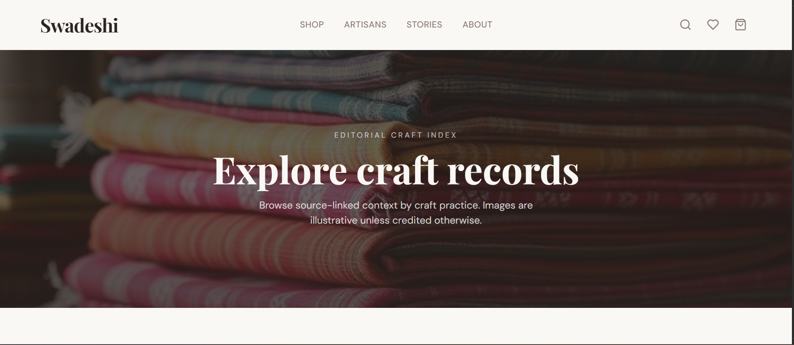

<table>
  <tr>
    <td width="50%">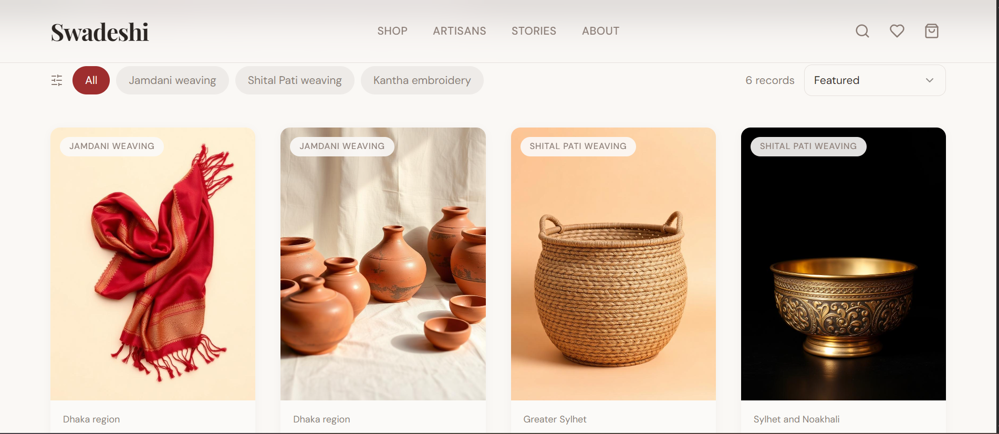</td>
    <td width="50%">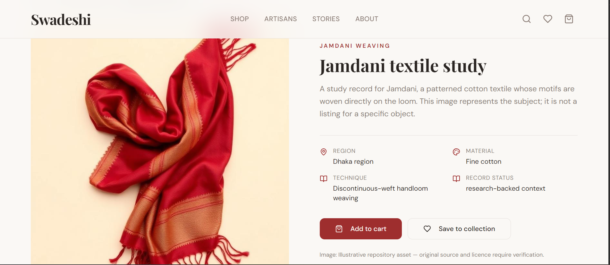</td>
  </tr>
</table>

A slide-out cart records real orders to your account; no payment is taken.

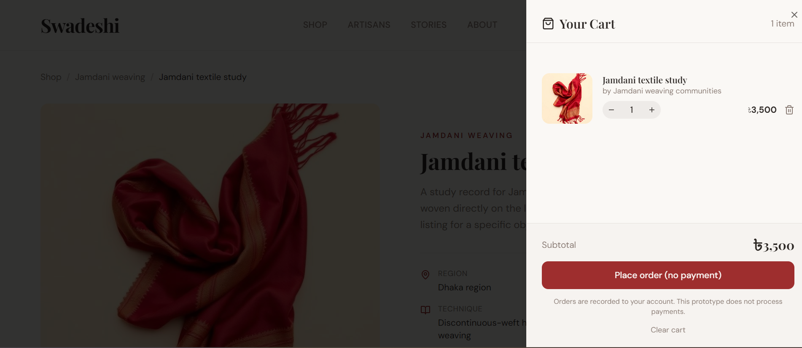

### Accounts

Email and password sign-in (bcrypt-hashed, JWT sessions) unlocks the saved
collection and order history.

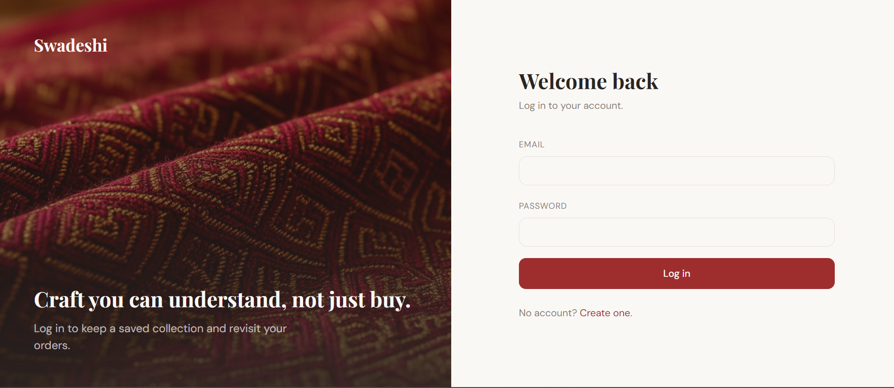

### Stories

An editorial journal about the crafts — a featured lead article and a grid of
short reads.

<table>
  <tr>
    <td width="50%">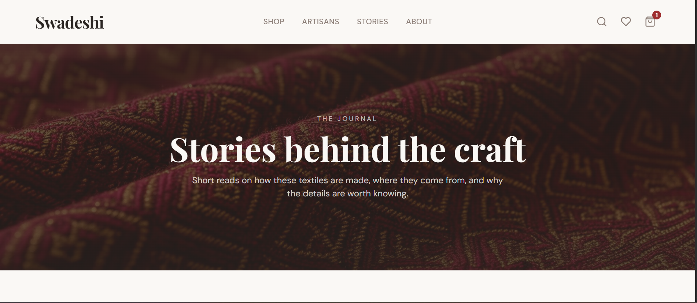</td>
    <td width="50%">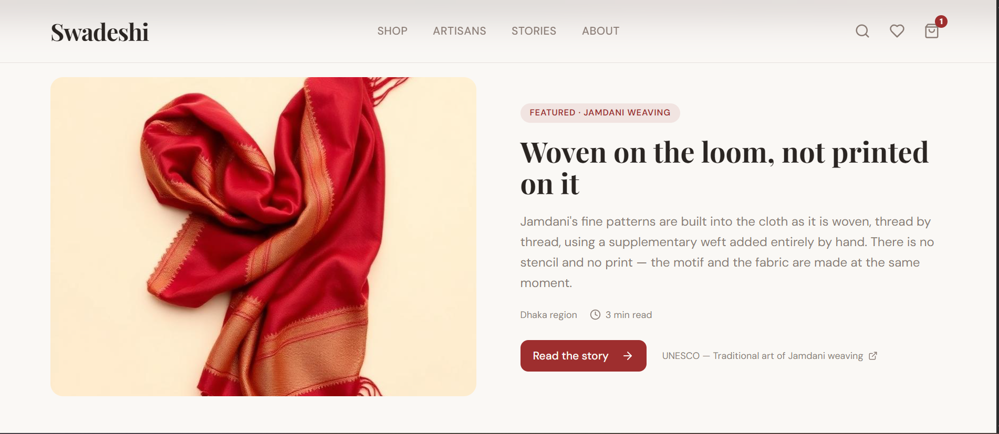</td>
  </tr>
</table>

### Artisans

A directory of the maker communities behind the craft, and individual context
profiles.

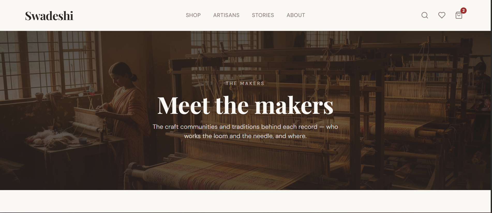

<table>
  <tr>
    <td width="50%">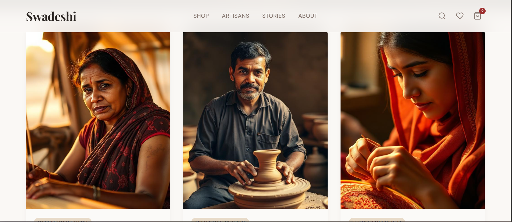</td>
    <td width="50%">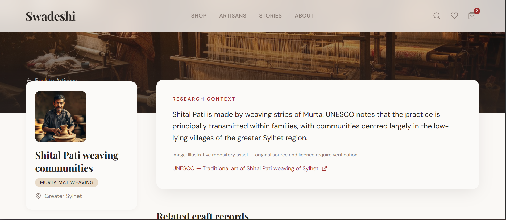</td>
  </tr>
</table>

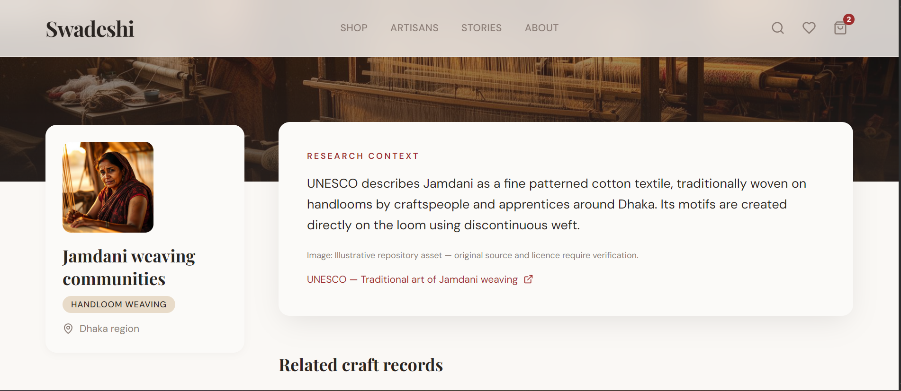

### About

<table>
  <tr>
    <td width="50%">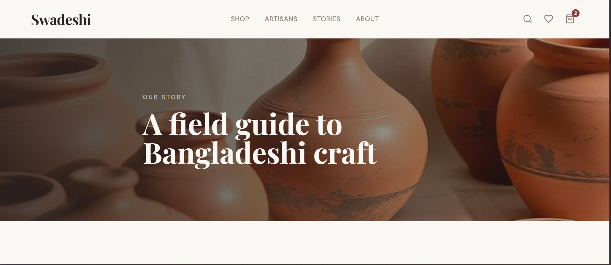</td>
    <td width="50%">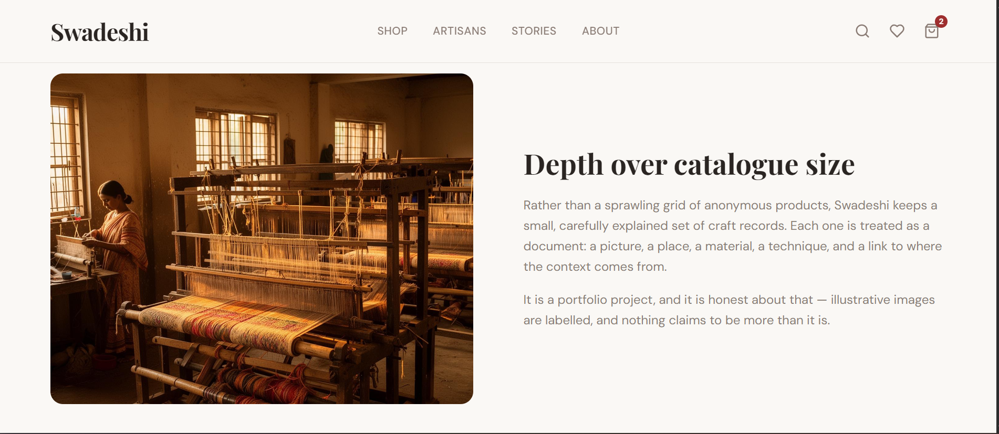</td>
  </tr>
</table>

## Limitations

This is a portfolio prototype and is deliberately clear about its boundaries:

- **Local database.** Data is stored in a local SQLite file created by the
  server. It is meant for development and demonstration, not multi-tenant
  production traffic.
- **No real payments.** Orders are recorded to the database, but no payment is
  processed and no money is charged.
- **Illustrative imagery.** Object-specific images are labelled illustrative
  until their origin and licence are verified. Cultural context is source-linked.

## License

MIT — see [LICENSE](LICENSE).
# swadeshi

